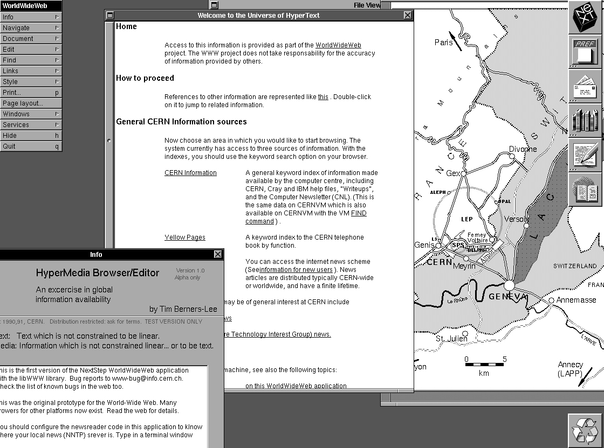

# History of the World Wide Web

The World Wide Web originally started out as a document exchange network to
meet the demand for automated information-sharing between academics across the world.

Running on a NeXT computer at CERN, the [first ever Web page](http://info.cern.ch/hypertext/WWW/TheProject.html) was a simple HTML document containing links to the project itself and a few other technical details. 
The first ever web browser had many features of current Web browsers and also 
included the ability to modify pages from directly inside the browser.

With its ubiquity and maturation, the complexity of this network and its 
associated technologies grew. Not only was it required for it to be available
across a wide range of operating systems and devices, but the kind of content
being exchanged also vastly changed. One of the languages that emerged as a robust
and efficient way to access and interact with elements of an HTML document was
JavaScript. Contrasted against various other technologies like ActiveX, JavaBeans,
or Flash, JavaScript had a lower barrier to entry. This meant that literally anyone,
even those who weren't technical, could enhance their website with dynamic content
with the use of JavaScript. 

This led to the dominance of JavaScript as the de facto compilation target for various
other languages and its ubiquity, as we know it today.
