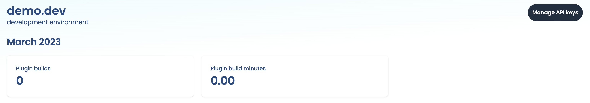

# Quickstart

This quickstart will help you learn how to create an app plugin using SE2 and a demo app we've created so you can get started right away!. Along the way it'll also introduce some of SE2's key features:

- Managing development environments
- Managing user access
- Using the plugin editor

## Meet PRO.xyz: our demo app

PRO.xyz (read: "proxies") is an imaginary company that operates networking services. Its services can be used to load-balance & cache requests, as well as protect its customers' servers from network attacks.

Of course this is just a demonstration, so what happens behind the scenes is that our service generates a made-up "request log" of inbound HTTP requests that are being forwarded to upstream hosts. PRO.xyz' clients are able to view these requests in their dashboard.

Most providers have their own logic and algorithms that detect abuse, send out alerts or initiate protective measures. They may allow for some customizability, but it's usually **very** limited.

PRO.xyz, on the other hand, has decided to make it possible for its users to fine-tune protections and alerts using the Suborbital Extension Engine. Suborbital's plugin system is used here to give users additional control and flexibility around deciding how requests are handled.

For this demo we'll just focus on tagging suspicious requests, helping the provider improve its protections.

## Preliminary steps

- [Create an account on our admin dashboard](https://suborbital.network)
- [Clone the repo for this quickstart](https://github.com/suborbital/examples)

Let's go! 🚀

## Create an organization

This is a new account, so we'll need to create our first organization: a (potentially shared) account in which one or more users manage(es) their Suborbital subscription .  For this demo, we'll give our organization:

- The name `DemoCompany` (note: organization names can contain only letters, numbers, and underscores)
- The description `Always ready to demo`


## Create an environment

We can set up multiple separate environments for each of our organizations. These could be used for separating development/staging/production environments or to create different applications for distinct use cases.

Let's set up our first environment for development! We'll give it:

- The name `demo.dev`
- The description `development environment`


Once we've created our environment, we'll be shown our environment's dashboard. The dashboard contains information about various usage metrics related to the Extension Engine.

Here we can see a counter for plugin builds and build minutes. Both of these are currently 0 because we still need to set up our first integration.



## Create an access key

Next, we'll need to create an access key. We'll click on:

- Manage access keys
- Create new access key

Our integration will use this access key to provision resources and execute plugins in SE2. We'll give our access key:

- The name `DemoKey`
- The description: `demo access key`


:::tip
We'll only be shown this access key once, so we'll need to store it somewhere safe and secure!
:::

## Integrate SE2 with our app

We'll need to supply our environment variables (our environment access key and the name of our environment) to SE2. Within the directory that contains our app, we'll:

- Create a file named `.env`
- Within our new `.env` file, we'll add our environment variables:

  - `SUBORBITAL_TOKEN` is our environment's access key
  - `SUBORBITAL_ENV` is the name we gave our environment

- Next we'll need to export those variables by running:

```bash
set -a
```

- And then:

```bash
source .env
```

## Create a tenant (user)

Suborbital lets an application's users create their own secure, sandboxed plugins, carefully isolated from the core of the system and one another. For this reason, we will create a new tenant, which is a user account with its own plugins inside Suborbital. Our application will then connect the tenant with one of its own internally-maintained users.

✨ Tenant API things ✨

## Meet the editor

The SE2 plugin editor uses SE2's APIs from either [Go](./how-to/se2-go.md) or [JavaScript/TypeScript](./how-to/se2-js.md) to provide a low-friction environment for your users to write, build, test, and deploy plugins to your SE2 an instance in a single place.  Alternatively, the [Builder API](https://reference.suborbital.dev/) can be used programmatically, if that better suits your use case.

### Obtain an editor token

In addition to the `IDENTIFIER` and `ENV_TOKEN`, you’ll also need to set `NAMESPACE` and `fn` to the name of our namespace (e.g. `default`) and the name of our plugin (e.g. `hello`). Copy the `token` field in the response; this is your editor token.

```bash
curl --location --request GET "http://local.suborbital.network:8082/auth/v2/access/${IDENTIFIER}/${NAMESPACE}/${EXT}" \
--header "Authorization: Bearer ${ENV_TOKEN}"
```

### Editor URLs in production

To edit a plugin via the editor in a production environment, you—or more likely your application—must build a valid URL to pass to the editor.

Configure the URL like so:

- Domain: `https://editor.suborbital.network/`
- Query parameters:
  - `builder`: `https://your-builder.example.com`
  - `token`: The [env token you created above](#create-an-environment)
  - `ident`: The name of your environment followed by a period, followed by the name of your [tenant](./reference/glossary.md). In our case, it will be `dev.suborbital.user1`
  - `namespace`: the name of your namespace if different than “default”
  - `fn`: the name of your plugin
  - `template`: the name of the language you wish to use (Go or JavaScript)

Altogether, it should look something like `https://editor.suborbital.network/?builder=https://your-builder.example.com&ident=dev.suborbital.user1&fn=hello&template=javascript`

## Your first plugin

Paste the URL you created above into your browser to load the plugin editor. Once inside the editor, you can edit, build, test, and deploy your plugins all in one place! By default, the editor will load pre-populated with the greeting plugin below. You can use it to run the editor for the first time.

```javascript
import { log } from "@suborbital/runnable";

export const run = (input) => {
    let message = "Hello, " + input;

    log.info(message);
    return message;
};
```

- The plugin provided is complete, so we can just click "Build"
- In the "TEST" field, add some text. Here, we've added "new Suborbital user"
- Click "Run test"
- Toward the bottom of the editor, click "TEST RESULTS". There's our greeting!


### Executing plugins

Once your first plugin has been built and deployed, it can be run with a request to the Execution API.

```bash
export ENV_TOKEN=<your previously generated token>

curl http://local.suborbital.network:8080/com.suborbital.acmeco/default/hello/v1.0.0 \
     --header "Authorization: Bearer $ENV_TOKEN" \
     -d 'my friend'

hello, my friend
```

## Connect your application

Now that you've set up SE2 and created your first plugin, you can use SE2's APIs from either [Go](./how-to/se2-go.md) or [JavaScript/TypeScript](./how-to/se2-js.md) to start integrating plugins into your application!
Suborbital allows users to write custom plugins in their preferred language by clicking the "Language select" button, but unfortunately PHP is not on the list of supported languages—yet!—so Ada chooses JavaScript, another language she's quite comfortable with.

Go to the plugin editor. Configure the URL like so:

Domain: `https://editor.suborbital.network`

Query params:

`token`: The token you received in step 11

`builder`: `https://builder.suborbital.network`

`ident`: your tenant identifier

`fn`: the name of your plugin `namespace`: the name of your namespace if different than “default”

`template`: the name of the language you wish to use

Altogether, it should look something like [`https://editor.suborbital.network/?token=eyJLZXkiOjcsIlNlY3JldCI6IlJTRUlrRWNiYzBleDhhUEEvUkltcVVPN3BmcmEreG9hYkgzdnhIRFhIK2M9In0=&builder=https://builder.suborbital.network&template=javascript&ident=dev.suborbital.user1&fn=foo`]

PRO.xyz' integration only supports deploying one plugin per user. This is all up to the application, who may choose to allow their users build, deploy and use any number of plugins in any language, the sky is the limit.

The editor already comes pre-loaded with a generic JavaScript template, but we have Ada's module to use instead.

At the very baseline of it a plugin receives some input, processes that input, and may produce some output. Suborbital allows extra APIs (sort of superpowers) to be exposed to these modules at the operator's discretion.

Here we are including the "log" API to have our application log any unexpected issues with the input data

We'll replace the default code in the editor with Ada's code below:

```js
import { log } from "@suborbital/runnable";

export const run = (input) => {
    const tags = [];
    try {
        let data = JSON.parse(input);

        // We don't operate Wordpress sites so this is immediately sus
        if (data?.uri?.includes("wp-login.php")) {
            tags.push("kinda-sus");
        }

        return JSON.stringify(tags);
    } catch (e) {
        log.error("Failed parsin incoming log data as JSON");
    }
};
```

We're to click "Build" and have our JavaScript source code compiled to a deployable WebAssembly plugin!

## Test

Great, that's done, we get to test it to see if it does what we expect!

We have a text field for specifying the "input" of this test run, I have a sample input prepared here that requests the Wordpress login page, and so it should trigger our module's spidey-senses.

We'll paste the text below into the "Test" field:

```text
{
   "id": "l9rkryfrn7",
   "request_start": "2022-10-27T20:21:36.538Z",
   "request_time": 0.1659020390745758,
   "remote_addr": "206.80.131.46",
   "remote_asn": "AS54113 FASTLY",
   "remote_cc": "FI",
   "request_length": 2252,
   "host": "noisy-cheeto.xyz",
   "method": "DELETE",
   "status": 200,
   "uri": "/wp-login.php",
   "upstream_host": "www0",
   "user_agent": "GoobleBot 1.0 (crawler)",
   "content_type": "text/html",
   "tags": []
}
```

And click "Run test". Sure enough, the output shown in the "output" field is: `kinda sus`! Our module returns an array of string "tags", which PRO.xyz will use to annotate the requests. Perhaps in this case, PRO.xyz (TODO: should this be Ada?) could use them to fine-tune its algorithms or abuse-mitigation strategies.

## Deploy

Alright, let's get this deployed by clicking:

- "Deploy"
- "Done"

And now we can head back to our dashboard. When I deployed our plugin, PRO.xyz was notified of this new custom integration for Ada, and will execute the WebAssembly module for all requests to make sure requests are properly tagged and its mitigation strategies tuned.

_kinda-sus pops up in one of the rows in the log_ (TODO: how can we make this joke accessible?)

There we go, we got our first internet troublemaker exposed, and we've seen how Suborbital Extension Engine can give application owners a way to let their users write their own plugins without compromising speed or security!

## What else can I do?

Now that you've know how to get SE2 extensibility powers into your app, you might want to:

- Learn more about using SE2's APIs from either [Go](./how-to/se2-go.md) or [JavaScript/TypeScript](./how-to/se2-js.md)
- Make custom [plugin templates](./how-to/customize-plugins/custom-plugin-templates.md) and [libraries](./how-to/customize-plugins/custom-libraries.md) to help your users get started building their own plugins for your app
- Organize your users' plugins into [namespaces](./how-to/customize-plugins/namespaces.md) for different use cases

## Questions?

If you have any questions you can't find answers to in these docs, please email us at team@suborbital.dev!
