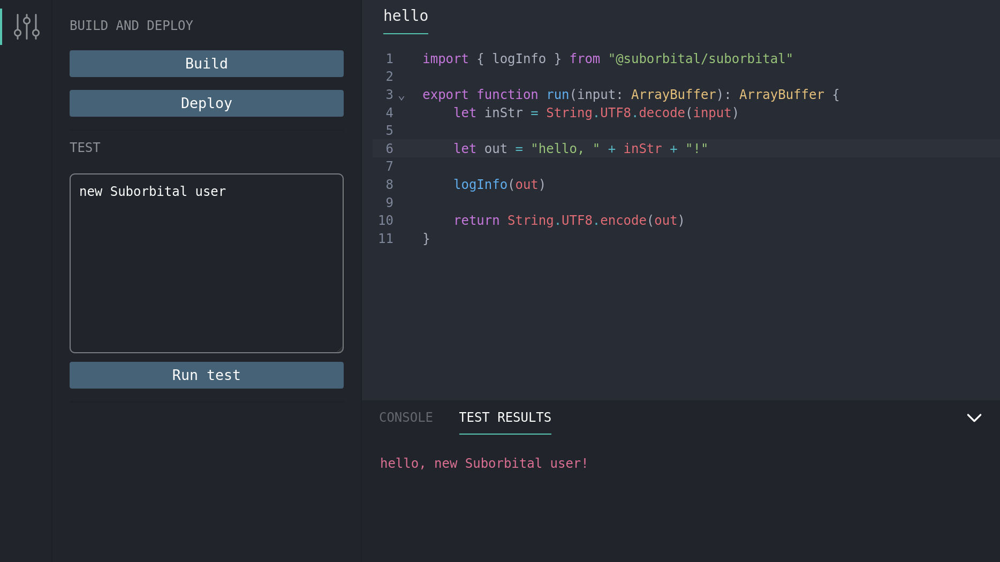

# Quickstart

<!-- 
Yes, the lines below feel like they should come before the heading, but if they do, the heading won't be capitalized. This is goofy, but true. 🙃 
-->

import Tabs from '@theme/Tabs';
import TabItem from '@theme/TabItem';

<!-- 
TODO: add "click this, then that" sort of scaffolding 
-->

<!-- 
TODO: intro bits, including explicit learning objectives like https://docs.netlify.com/get-started/
-->

<!-- 

TODO: write this section

## Prerequisites

MacOS or Linux, Go or JS/TS for sure, but are there other requirements? Can any app drop SE2 in?

-->

## Preliminary steps

To get started, you'll need to complete these steps:

- Create an account on our [admin dashboard](https://suborbital.network)

- Click "Create new organization", then in the text fields enter:
  - Organization name: the name of your company or organization
  - Organization description: a few words describing what your organization does (just for your own reference!)

If you are not automatically redirected, then select the organization you just created.

## Create an environment

You can set up multiple separate environments within an organization. These could be used for separating production/development/staging environments,or to create different applications for distinct use cases.

Let's set up your first environment for development!

Click "New environment", then in the text fields enter:

- Environment name: a name for your development environment (this name must include a '.')
- Environment description: a few words describing what this environment will do (just for your own reference!)

Once you've created your environment, you'll be shown your environment's dashboard. The dashboard contains information about various usage metrics related to the Extension Engine, like counters for plugin builds and build minutes. Both of these are currently 0 because we still need to set up your first plugin!

## Create an access key

Next, you'll need to create an access key. Click on:

- Manage access keys
- Create new access key

Your integration will use this access key to provision resources and execute plugins in SE2. You'll need to give your access key:

- Key name: a name for this access key
- Key description: a few words describing what this access key will be used for (just for your own reference!)

You'll only be shown this access key once, so make sure to store it somewhere safe and secure!

## Create a tenant (user)

Suborbital lets an application's users—or "tenants"—create their own secure, sandboxed plugins, carefully isolated from the core of the system and one another. Each tenant account has its own plugins inside Suborbital.

To create a tenant, copy the code below and paste it into your terminal:

```bash
curl --location --request POST "https://controlplane.stg.suborbital.network/api/v2/tenant/${IDENTIFIER}" \
--header "Authorization: Bearer ${ACCESS_KEY}"
```

- Set `IDENTIFIER` to the name of your environment followed by a period, followed by the name of the tenant. If you had:
  - A dev environment named `dev.suborbital`
  - A tenant named `user1`
  - Your `IDENTIFIER` would be `dev.suborbital.user1`
- Replace `ACCESS_KEY` with the access key you created in the previous step

## Obtain an editor token

In addition to the `IDENTIFIER` and `ACCESS_KEY`, you’ll also need to set `NAMESPACE` and `FN` to the name of our namespace (e.g. `default`) and the name of our plugin (e.g. `foo`). Copy the `token` field in the response.

```bash
curl --location --request GET "https://builder.stg.suborbital.network/auth/v2/access/${IDENTIFIER}/${NAMESPACE}/${FN}" \
--header "Authorization: Bearer ${ACCESS_KEY}"
```

## Meet the editor

The Suborbital SE2 plugin editor uses [SE2's APIs](./using-api.md) to provide a low-friction environment for your users to write, build, test, and deploy plugins to your SE2 an instance in a single place.  Alternatively, the [Builder API](https://suborbital-compute.readme.io/reference/api-reference) can be used programmatically, if that better suits your use case.

### Editor URLs

To edit a plugin via the editor, you—or more likely your application—must build a valid URL to pass to the editor.

Configure the URL like so:

- Domain: `https://editor.suborbital.network/`
- Query parameters:
  - `token`: The token you created in the previous step
  - `builder`: `https://builder.stg.suborbital.network`
  - `ident`: your tenant's identifier
  - `fn`: the name of your plugin
  - `namespace`: the name of your namespace if different than “default”
  - `template`: the name of the language you wish to use (Go or JavaScript)

Altogether, it should look something like `https://editor.suborbital.network/?token=eyJLZXkiOjcsIlNlY3JldCI6IlJTRUlrRWNiYzBleDhhUEEvUkltcVVPN3BmcmEreG9hYkgzdnhIRFhIK2M9In0=&builder=https://builder.stg.suborbital.network&template=javascript&ident=dev.suborbital.user1&fn=my-plugin`

## Your first plugin

Paste the URL you created above into you browser to load the plugin editor. Once inside the editor, you can edit, build, test, and deploy your plugins all in one place! By default, the editor will load pre-populated with the greeting plugin below. You can use it to run the editor for the first time.

```javascript
import { log } from ''@suborbital/runnable";

export const run = (input) => {
    let message = "Hello, " + input;
    
    log.info(message);
    return message;
};
```

- The plugin provided is complete, so we can just click "Build"
- In the "TEST" field, add some text. Here, we've added "new Suborbital user"
- Click "Run test"
- Toward the bottom of the editor, click "TEST RESULTS". There's our greeting!



### Executing plugins

Once your first plugin has been built and deployed, it can be run with a request to the Execution API.

```bash
export ENV_TOKEN=<your previously generated token>

curl http://local.suborbital.network:8080/com.suborbital.acmeco/default/hello/v1.0.0 \
     --header "Authorization: Bearer $ENV_TOKEN" \
     -d 'my friend'

hello, my friend
```

:::tip
If you're invoking the Test API, you'll need to import the [Editor Token](./customizing-plugins/code-editor#editor-token.md) instead of the Environment token in the code snippet above.
:::

## Connect your application

Now that you've set up SE2 and created your first plugin, you can use [SE2's APIs](./using-api.md) to start integrating functions into your application.
