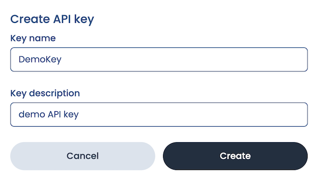

import Tabs from '@theme/Tabs';
import TabItem from '@theme/TabItem';

# Quickstart

This quickstart will help you learn how to create an app plugin using SE2. Along the way it'll also introduce some of SE2's key features:

- Managing development environments
- Managing user access
- Using the plugin editor

## Preliminary steps

- [Create an account on our admin dashboard](https://suborbital.network)
- Check out our language support page to see a list of languages and their respective support statuses for SE2

Let's go! 🚀

## Create an organization

This is a new account, so we'll need to create our first organization: a (potentially shared) account in which one or more users manage(es) their Suborbital subscription . For this demo, we'll give our organization:

- The name `DemoCompany` (note: organization names can contain only letters, numbers, and underscores)
- The description `Always ready to demo`


## Create an environment

We can set up multiple separate environments for each of our organizations. These could be used for separating development/staging/production environments or to create different applications for distinct use cases.

Let's set up our first environment for development! We'll give it:

- The name `demo.dev`
- The description `development environment`


Once we've created our environment, we'll be shown our environment's dashboard. The dashboard contains information about various usage metrics related to the Extension Engine.

Here we can see a counter for plugin builds and build minutes. Both of these are currently 0 because we still need to set up our first integration.


## Create an API key

Next, we'll need to create an API key. We'll click on:

- Manage API keys
- Create new API key

Our integration will use this API key to provision resources and execute plugins in SE2. We'll give our API key:

- The name `DemoKey`
- The description: `demo API key`



:::tip
We'll only be shown this API key once, so we'll need to store it somewhere safe and secure!
:::

## Using the SE2 SDK

SE2 provides client libraries for Go and Node.js. Start by installing the client:

<Tabs groupId="sdk-import">

<TabItem value="sdk-go" label="Using Go">
In your terminal issue the following command to grab the library.

```sh
$ go get github.com/suborbital/se2-go@latest
```

</TabItem>

<TabItem value = "sdk-js" label = "Using JS">

```bash
npm install @suborbital/se2-node
```

</TabItem>

</Tabs>

Next, initialize the client with your API key:

<Tabs groupId="sdk-init">

<TabItem value="sdk-init-go" label="Using Go">

```go
package main

import (
  "log"

  "github.com/suborbital/se2-go"
)

func main() {
  client, err := se2.NewClient(se2.ModeStaging, api_key)
  if err != nil {
    log.Fatalf("encountered new client error: %s", err.Error())
  }

  // client is now ready to use
}
```

</TabItem>

<TabItem value = "tenant-js" label = "Using JS">

```js
import { Suborbital } from "@suborbital/se2-node";

// Here, we've provided the API key via the `API_KEY` environment variable.
const suborbital = new Suborbital(process.env.API_KEY);
```

</TabItem>

</Tabs>

## Create a tenant (user)

Suborbital lets an application's users create their own secure, sandboxed plugins, carefully isolated from the core of the system and one another. For this reason, we will create a new tenant, which is a user account with its own plugins inside Suborbital. Our application will then connect the tenant with one of its own internally-maintained users. Typically, you'll want to use your system's unique ID for the user as the name of the tenant.

<Tabs groupId="tenant-creation">

<TabItem value="tenant-go" label="Using Go">

```go
func main() {
  tenant, err := client.CreateTenant(ctx, "tenantName", "tenantDescription")
  if err != nil {
    log.Fatalf("create tenant failed: %s", err.Error())
  }
}
```

</TabItem>

<TabItem value = "tenant-js" label = "Using JS">

```js
const tenant = "<user ID>";
await suborbital.admin.createTenant({ tenant });
```

</TabItem>

<TabItem value = "tenant-curl" label = "Using cURL">

```bash
POST api/v1/tenant HTTP/2
Host: api.suborbital.network
Content-Type: application/json
Authorization: Bearer API_KEY 

{
  "name": "org.example.tenvantx",
  "description": "hello world tenant"
}
```

</TabItem>

</Tabs>

## Meet the editor

The SE2 plugin editor uses SE2's APIs from either [Go](./how-to/se2-go.md) or [JavaScript/TypeScript](./how-to/se2-js.md) to provide a low-friction environment for your users to write, build, test, and deploy plugins to your SE2 an instance in a single place. Alternatively, the [Builder API](https://reference.suborbital.dev/) can be used programmatically, if that better suits your use case.

### Obtain a session token

To grant a user access to modify a plugin, you'll need a session token. A session token is bound to a single plugin, and you'll create new tokens each time a user needs access to a plugin. To obtain a session token:

<Tabs groupId='session-token'>

<TabItem value="go" label="Using Go">
Call the `CreateSession` method with your tenant's name, the namespace, and the plugin name of your intended plugin. The response will be a struct that contains the session token. All tenant API methods will use this session response struct as input.

```go
func main() {
  session, err := client.CreateSession(ctx, "tenantName", "namespace", "pluginName")
  if err != nil {
    log.Fatalf("creating session failed with %s", err.Error())
  }

  // To use the session token in a further call
  draft, err := client.CreatePluginDraft(ctx, "javascript", session)
  if err != nil {
    log.Fatalf("creating plugin draft for javascript failed: %s", err.Error())
  }
}
```

</TabItem>

<TabItem value = "js" label = "Using JS">

```js
const params = {
  tenant: "<user ID>", // the user this plugin belongs to
  namespace: "<namespace>", // the plugin's namespace
  name: "<plugin name>", // the name of the plugin
};
const token = await suborbital.admin.createSession(params);
```

</TabItem>

<TabItem value = "curl" label = "Using cURL">

```bash
curl --location --request GET "http://local.suborbital.network:8082/auth/v2/access/${IDENTIFIER}/${NAMESPACE}/${EXT}" \
--header "Authorization: Bearer ${API_KEY}"
```

</TabItem>

</Tabs>

### Editor URLs in production

To edit a plugin via the editor in a production environment, you—or more likely your application—must build a valid URL to pass to the editor.

<Tabs groupId='editor-url'>

<TabItem value="react" label="Using React">

```js
React version goes here
```

</TabItem>

<TabItem value="browser" label="Using a browser tab">

Configure the URL like so:

- Domain: `https://editor.suborbital.network/`
- Query parameters:
  - `template`: the name of the template you wish to use
  - `token`: The [session token you created above](#create-an-environment)
  

Altogether, it should look something like `https://editor.suborbital.network/?template=javascript&token=<session token>`

</TabItem>

</Tabs>

## Your first plugin

Paste the URL you created above into your browser to load the plugin editor. Once inside the editor, you can edit, build, test, and deploy your plugins all in one place! By default, the editor will load pre-populated with the greeting plugin below. You can use it to run the editor for the first time.

```javascript
import { log } from "@suborbital/runnable";

export const run = (input) => {
  let message = "Hello, " + input;

  log.info(message);
  return message;
};
```

- The plugin provided is complete, so we can just click "Build"
- In the "TEST" field, add some text. Here, we've added "new Suborbital user"
- Click "Run test"
- Toward the bottom of the editor, click "TEST RESULTS". There's our greeting!


### Executing plugins

Once your first plugin has been built and deployed, it can be run with a request to the Execution API.

<Tabs groupId='execute-plugin'>

<TabItem value="go" label="Using Go">

```go
Go version goes here
```

</TabItem>

<TabItem value = "js" label = "Using JS">

```js
const params = {
  tenant: "<user ID>", // the user this plugin belongs to
  namespace: "<namespace>", // the plugin's namespace
  name: "<plugin name>", // the name of the plugin
};
const result = await suborbital.exec.run(params, "my friend!");
console.log(result.result); // hello, my friend!
```

</TabItem>

<TabItem value = "curl" label = "Using cURL">

```bash
export API_KEY=<your previously generated key>

curl http://local.suborbital.network:8080/com.suborbital.acmeco/default/hello/v1.0.0 \
     --header "Authorization: Bearer $API_KEY" \
     -d 'my friend!'

# hello, my friend!
```

</TabItem>

</Tabs>

## What else can I do?

Now that you've know how to get SE2 extensibility powers into your app, you might want to:

- Learn more about using SE2's APIs from either [Go](./how-to/se2-go.md) or [JavaScript/TypeScript](./how-to/se2-js.md)
- Make custom [plugin templates](./how-to/customize-plugins/custom-plugin-templates.md) and [libraries](./how-to/customize-plugins/custom-libraries.md) to help your users get started building their own plugins for your app
- Organize your users' plugins into [namespaces](./how-to/customize-plugins/namespaces.md) for different use cases

## Questions?

If you have any questions you can't find answers to in these docs, please email us at team@suborbital.dev!
