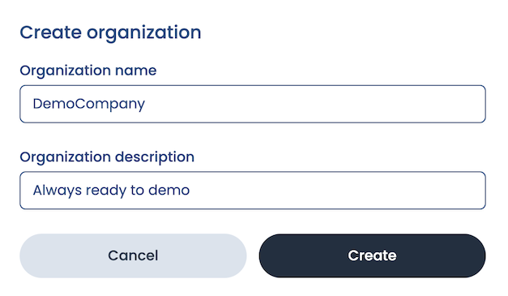
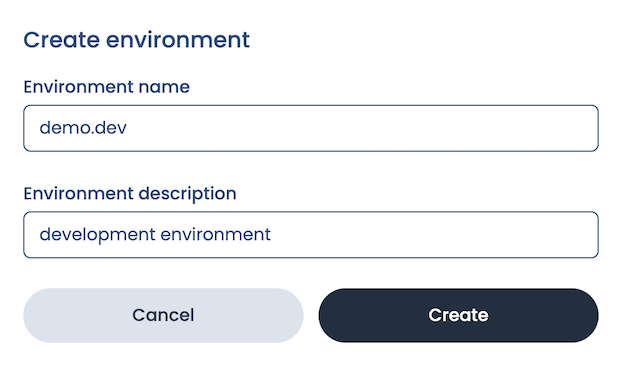

import Tabs from '@theme/Tabs';
import TabItem from '@theme/TabItem';

# Quickstart

This quickstart will help you learn how to create an app plugin using SE2. Along the way it'll also introduce some of SE2's key features:

- Managing development environments
- Managing user access
- Using the plugin editor

## Meet PRO.xyz: our demo app

PRO.xyz (read: "proxies") is an imaginary company that operates networking services. Its services can be used to load-balance & cache requests,as well as protect its customers' servers from network attacks.

Of course this is just a demonstration, so what happens behind the scenes is that our service generates a made-up "request log" of inbound HTTP requests that are being forwarded to upstream hosts.PRO.xyz' clients are able to view these requests in their dashboard.

Most providers have their own logic and algorithms that detect abuse,send out alerts or initiate protective measures. They may allow for some customizability, but it's _usually_ very limited.

PRO.xyz, on the other hand, has decided to make it possible _for its users_ to fine-tune protections and alerts using the Suborbital Extension Engine. Suborbital's plugin system is used here to give users additional control and flexibility around deciding how requests are handled.

For this demo we'll just focus on tagging suspicious requests, helping the provider improve its protections.

## Preliminary steps

- [Create an account on our admin dashboard](https://suborbital.network)
- [Clone the repo for this quickstart](https://github.com/suborbital/examples)
- Make sure [Docker](https://www.docker.com/) is installed

Let's go! 🚀

## Create an organization

This is a new account, so we'll need to create our first organization: a (potentially shared) account in which one or more users manage(es) their Suborbital subscription .  For this demo, we'll give our organization:

- The name `DemoCompany` (note: organization names can contain only letters, numbers, and underscores)
- The description `Always ready to demo`



## Create an environment

We can set up multiple separate environments for each of our organizations. These could be used for separating development/staging/production environments or to create different applications for distinct use cases.

Let's set up our first environment for development! We'll give it:

- The name `demo.dev`
- The description `development environment`



Once we've created our environment, we'll be shown our environment's dashboard. The dashboard contains information about various usage metrics related to the Extension Engine.

Here we can see a counter for plugin builds and build minutes. Both of these are currently 0 because we still need to set up our first integration.


## Create an access key

Next, we'll need to create an access key. We'll click on:

- Manage access keys
- Create new access key

Our integration will use this access key to provision resources and execute plugins in SE2. We'll give our access key:

- The name `DemoKey`
- The description: `demo access key`


:::tip
We'll only be shown this access key once, so we'll need to store it somewhere safe and secure!
:::

## Integrate SE2 with our app

Within the directory we created when we cloned the repo for this demo in the [preliminary steps](#preliminary-steps), we'll:

- Open the `demo-proxyz` directory
- Open `.env.example`
- Supply our environment variables:

  - `SUBORBITAL_TOKEN` is our environment's access key
  - `SUBORBITAL_ENV` is the name we gave our environment

### Build the front and backends

- Set up the Astro/frontend development server:

  ```bash
  npm install && npm run dev
  ```

- Build the backend:

  ```bash
  npm run build && npm run serve
  ```

- Build the Docker container:

  ```bash
  docker build -t se2-demo .
  ```

- Supply the required environment variables:

  ``` bash
  docker run -it --env SUBORBITAL_TOKEN --env SUBORBITAL_ENV=demo.dev -p 8080:8080 se2-demo
  ```

## Create a tenant (user)

Suborbital lets an application's users create their own secure, sandboxed plugins, carefully isolated from the core of the system and one another. For this reason, we will create a new tenant, which is a user account with its own plugins inside Suborbital. Our application will then connect the tenant with one of its own internally maintained users.

It's choose your own adventure time! Click one of the tabs below to continue in either our web app or in your command line:

<Tabs groupId='create-tenant'>

<TabItem value="web-app" label="Web app">

[Type "ada" into the Tenant field]

Our environment name ("demo.dev") and tenant name ("ada") together will form the Identifier. Think of this as a bucket to hold all of a user's plugins separate from the others.

(TODO: access key)

Should there be need of further namespacing a tenant's modules, Suborbital provides a "namespace" feature. For now, we will just leave this on "default".

</TabItem>

<TabItem value="CLI" label="Command line">

(TODO: assimilate this wording)

Set `IDENTIFIER` to the name of your environment followed by a period, followed by the name of the tenant. In our case, it will be `dev.suborbital.user1`. The `ACCESS_KEY` should be set to the access key we copied in step 9.

```bash
curl --location --request POST "https://controlplane.stg.suborbital.network/api/v2/tenant/${IDENTIFIER}" \
--header "Authorization: Bearer ${ACCESS_KEY}"
```

</TabItem>

</Tabs>

## A PRO.xyz user journey

The application architecture itself is nothing out of ordinary; it's a Node.js app communicating with a simple HTML frontend using Vue.js. Our backend, as mentioned, generates fake "ingest logs" of network requests, our WebAssembly plugins will receive this request metadata, and attempt to spot abuse.

We provide many pre-built components to make all of this a little easier: the frontend integrates with the Suborbital Module Editor, while the backend uses the JS SDK to interface with the SE2 REST API and our hosted Edge Dataplane.

So time to put ourselves in the shoes of Ada, a PRO.xyz customer who just received access to Suborbital plugins on PRO.xyz' platform.

- We'll give our customer the name `Ada`
- And we can type whatever we like for this pretend password
- Click "Sign in"

After logging in, we see the network requests as they are received by PRO.xyz' servers, and eventually forwarded to our upstream servers. When we pause the logs by clicking the "pause" button, though, we notice something peculiar...

There have been some requests to `wp-login.php`. Well, little wonder these were always met with a 404 Not Found response! Ada's servers run PHP indeed, but none of them are Wordpress sites! Clearly, someone is trying to find Wordpress vulnerabilities or exploit weak passwords for Wordpress sites on the internet, and they also ended up probing Ada's sites. To say this was "suspicious" would be a gross understatement.

Normally there wouldn't be much Ada could do about this, but thanks to the custom plugins we may actually turn this ship around.

## Build a module

Suborbital allows users to write custom plugins in their preferred language by clicking the "Language select" button, but unfortunately PHP is not on the list of supported languages—yet!—so Ada chooses JavaScript, another language she's quite comfortable with.

<Tabs groupId='editor-token'>

<TabItem value="web-app" label="Web app">

Clicking on the button that looks like three planes stacked vertically with a "+" next to them <!-- TODO: give this button an ID!-->, Ada opens up the Suborbital Module Editor that presents her with an interface for writing, compiling, and deploying plugins.

</TabItem>

<TabItem value="CLI" label="Command line">

Go to the plugin editor. Configure the URL like so:

Domain: `https://editor.suborbital.network`

Query params:

`token`: The token you received in step 11

`builder`: `https://builder.stg.suborbital.network`

`ident`: your tenant identifier

`fn`: the name of your plugin `namespace`: the name of your namespace if different than “default”

`template`: the name of the language you wish to use

Altogether, it should look something like [`https://editor.suborbital.network/?token=eyJLZXkiOjcsIlNlY3JldCI6IlJTRUlrRWNiYzBleDhhUEEvUkltcVVPN3BmcmEreG9hYkgzdnhIRFhIK2M9In0=&builder=https://builder.stg.suborbital.network&template=javascript&ident=dev.suborbital.user1&fn=foo`]

</TabItem>

</Tabs>

PRO.xyz' integration only supports deploying one plugin per user. This is all up to the application, who may choose to allow their users build, deploy and use any number of plugins in any language, the sky is the limit.

The editor already comes pre-loaded with a generic JavaScript template, but we have Ada's module to use instead.

At the very baseline of it a plugin receives some input, processes that input, and may produce some output. Suborbital allows extra APIs (sort of superpowers) to be exposed to these modules at the operator's discretion.

Here we are including the "log" API to have our application log any unexpected issues with the input data

We'll replace the default code in the editor with Ada's code below:

```js
import { log } from "@suborbital/runnable";

export const run = (input) => {
    const tags = [];
    try {
        let data = JSON.parse(input);

        // We don't operate Wordpress sites so this is immediately sus
        if (data?.uri?.includes("wp-login.php")) {
            tags.push("kinda-sus");
        }

        return JSON.stringify(tags);
    } catch (e) {
        log.error("Failed parsin incoming log data as JSON");
    }
};
```

We're to click "Build" and have our JavaScript source code compiled to a deployable WebAssembly plugin!

## Test

Great, that's done, we get to test it to see if it does what we expect!

We have a text field for specifying the "input" of this test run, I have a sample input prepared here that requests the Wordpress login page, and so it should trigger our module's spidey-senses.

We'll paste the text below into the "Test" field:

```text
{
   "id": "l9rkryfrn7",
   "request_start": "2022-10-27T20:21:36.538Z",
   "request_time": 0.1659020390745758,
   "remote_addr": "206.80.131.46",
   "remote_asn": "AS54113 FASTLY",
   "remote_cc": "FI",
   "request_length": 2252,
   "host": "noisy-cheeto.xyz",
   "method": "DELETE",
   "status": 200,
   "uri": "/wp-login.php",
   "upstream_host": "www0",
   "user_agent": "GoobleBot 1.0 (crawler)",
   "content_type": "text/html",
   "tags": []
}
```

And click "Run test". Sure enough, the output shown in the "output" field is: `kinda sus`! Our module returns an array of string "tags", which PRO.xyz will use to annotate the requests. Perhaps in this case, PRO.xyz (TODO: should this be Ada?) could use them to fine-tune its algorithms or abuse-mitigation strategies.

## Deploy

Alright, let's get this deployed by clicking:

- "Deploy"
- "Done"

And now we can head back to our dashboard. When I deployed our plugin, PRO.xyz was notified of this new custom integration for Ada, and will execute the WebAssembly module for all requests to make sure requests are properly tagged and its mitigation strategies tuned.

_kinda-sus pops up in one of the rows in the log_ (TODO: how can we make this joke accessible?)

There we go, we got our first internet troublemaker exposed, and we've seen how Suborbital Extension Engine can give application owners a way to let their users write their own plugins without compromising speed or security!

## What else can I do?

Now that you've know how to get SE2 extensibility powers into your app, you might want to:

- Learn more about using SE2's APIs from either [Go](./how-to/se2-go.md) or [JavaScript/TypeScript](./how-to/se2-js.md)
- Make custom [module templates](./how-to/customize-plugins/custom-plugin-templates.md) and [libraries](./how-to/customize-plugins/custom-libraries.md) to help your users get started building their own plugins for your app
- Organize your users' plugins into [namespaces](./how-to/customize-plugins/namespaces.md) for different use cases

## Questions?

If you have any questions you can't find answers to in these docs, please email us at team@suborbital.dev!

<!-- TODO: add feedback section-->
